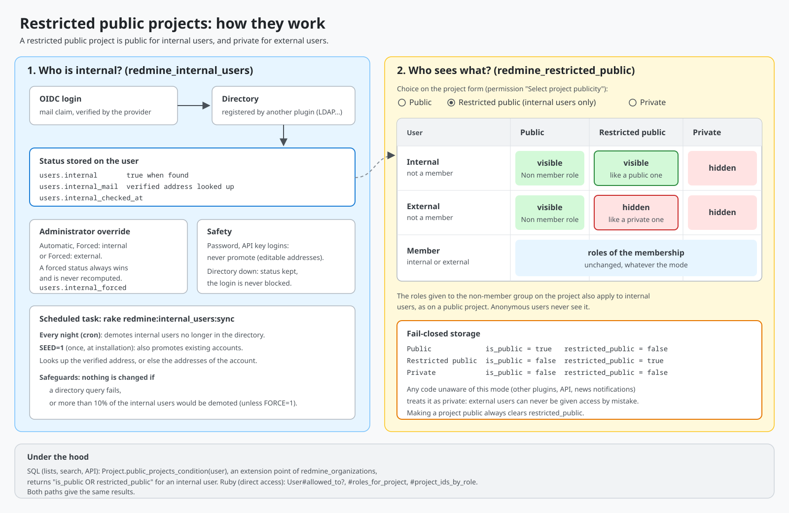

# Redmine Restricted Public

## Test status

|Plugin branch| Redmine Version | Test Status       |
|-------------|-----------------|-------------------|
|master       | 6.1.5           | [![6.1.5][2]][5]  |
|master       | 7.0.2           | [![7.0.2][1]][5]  |
|master       | master          | [![master][3]][5] |

[1]: https://github.com/nanego/redmine_restricted_public/actions/workflows/7_0_2.yml/badge.svg
[2]: https://github.com/nanego/redmine_restricted_public/actions/workflows/6_1_5.yml/badge.svg
[3]: https://github.com/nanego/redmine_restricted_public/actions/workflows/master.yml/badge.svg
[5]: https://github.com/nanego/redmine_restricted_public/actions

Adds a third project mode between public and private: a **restricted public** project behaves like a public project for **internal** users, and like a private project for **external** users.



(Source: [restricted_public.svg](restricted_public.svg).)

## Project mode

The "Public" checkbox of the project form becomes a choice between *Public*, *Restricted public (internal users only)* and *Private*, with the same permission (`select_project_publicity`). The mode can also be set through the API with `project[publicity]` (`public`, `restricted`, `private`) or `project[restricted_public]`.

A restricted public project is stored as a private one (`is_public = false`) with `restricted_public = true`. Any code reading `is_public` directly (other plugins, news notifications, the `is_public` API field...) treats it as private: external users can never be given access by mistake, internal users may just get a narrower experience there. Setting `is_public` always clears `restricted_public`.

For an internal user who is not a member, a restricted public project grants the same rights as a public one: the *Non member* role, or the roles given to the builtin non-member group on the project.

Not covered: the global permissions fallback (`User#roles`), and the functions of redmine_limited_visibility given to the non-member group.

## Internal users

Whether a user is internal comes from [redmine_internal_users](https://github.com/nanego/redmine_internal_users) (`User#internal_user?`), which computes it from a directory (LDAP server, HR service...) and lets administrators force it.

The project list has a "Restricted public" column and filter.

## Requirements

- [redmine_internal_users](https://github.com/nanego/redmine_internal_users)
- [redmine_organizations](https://github.com/jbbarth/redmine_organizations), which provides the `Project.public_projects_condition` extension point
- [redmine_base_deface](https://github.com/jbbarth/redmine_base_deface)

## Installation

```
bundle exec rake redmine:plugins:migrate NAME=redmine_restricted_public RAILS_ENV=production
```

## Tests

```
bundle exec rspec plugins/redmine_restricted_public/spec
```

The core test `ProjectsControllerTest#test_new_by_non_admin_should_enable_setting_public_if_default_role_is_allowed_to_set_public` fails with this plugin: it looks for the `project[is_public]` checkbox, replaced by the mode choice. The CI workflows exclude it.
